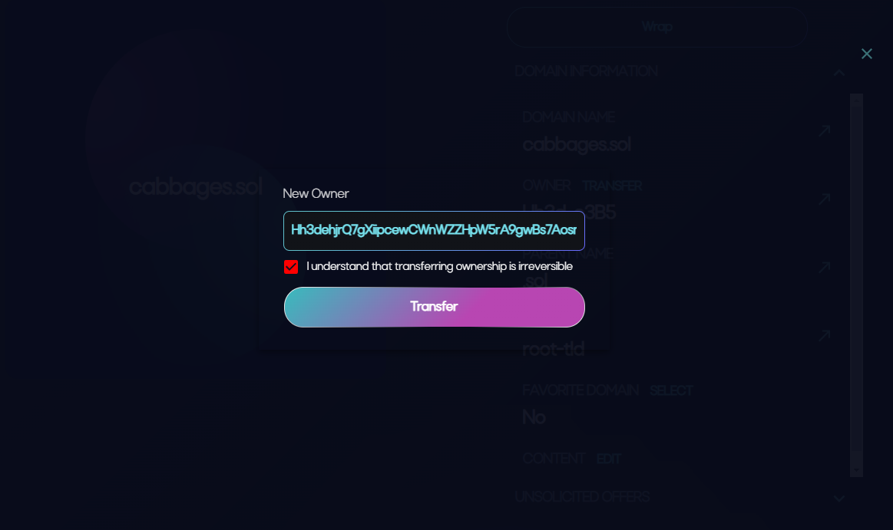

# Transfer your domain to another wallet

Click on the '[Domains](https://naming.bonfida.org/#/profile?view=domains)' option found under the 'Profile' option in the main menu on Bonafida and click 'Manage Domain'.

.png>)

Click on the 'Domain information' drop down to display the transfer option.

.png>)

It will bring up the following screen to enter the wallet address you would like to transfer your domain to.

Hit 'Transfer', approve the transaction in your wallet and it will be done.
